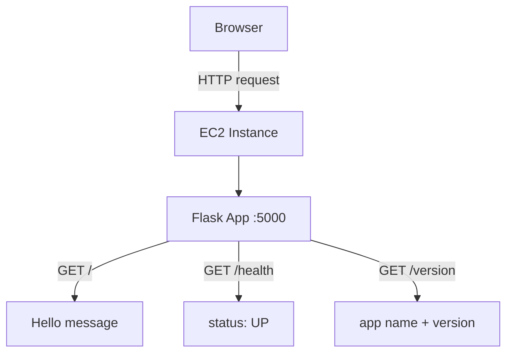

# Sample Python App

A minimal Flask application for testing a Python app deployment on an EC2 instance.

This project is intentionally simple — just a few routes with no database or external dependencies — so the focus stays on the deployment process itself rather than the application logic. It's meant as a hands-on way to practice DevOps/Cloud basics: launching an EC2 instance, connecting to it over SSH, running a Python app on it, and keeping that app alive and reachable from a browser.

## What it does

| Endpoint | Returns |
|---|---|
| `/` | A plain text greeting |
| `/health` | `{"status": "UP"}` |
| `/version` | `{"application": "sample-python-app", "version": "1.0.0"}` |

## Architecture



---

## Example setup (from actual deployment)

**EC2 Instance**

| Field | Value |
|---|---|
| Name | sample |
| Instance ID | i-003294b3908b89c9c |
| Instance type | t3.micro |
| Region / AZ | us-east-1 (us-east-1c) |
| Public IPv4 | 54.90.136.163 |
| Status | Running, 3/3 checks passed |

**Security Group inbound rules**

| Type | Protocol | Port range | Source | Purpose |
|---|---|---|---|---|
| Custom TCP | TCP | 5000 | 0.0.0.0/0 | Lets the Flask app be reached from any browser |
| SSH | TCP | 22 | 0.0.0.0/0 | Lets you connect to the instance via SSH |

> ⚠️ Source `0.0.0.0/0` allows access from **any** IP address on the internet. That's fine for a quick lab/demo, but for anything beyond testing, AWS recommends restricting the source to your own IP (select "My IP" instead of `0.0.0.0/0`).

---

## Step-by-step: Run it on an EC2 instance

### Step 1 — Copy the files to EC2

From your local machine (PowerShell or terminal):

```bash
scp -i "path/to/your-key.pem" app.py requirements.txt ec2-user@YOUR_EC2_PUBLIC_IP:/home/ec2-user/
```

Use `ubuntu@` instead of `ec2-user@` if your instance is Ubuntu-based.

### Step 2 — SSH into the instance

```bash
ssh -i "path/to/your-key.pem" ec2-user@YOUR_EC2_PUBLIC_IP
```

### Step 3 — Install dependencies

```bash
pip install -r requirements.txt
```

### Step 4 — Run the app

```bash
python3 app.py
```

You should see:
```
Running on http://127.0.0.1:5000
Running on http://172.31.x.x:5000
```

Leave this terminal open — this is the Flask server running in the foreground.

### Step 5 — Test it

Open a **second** SSH session into the same instance, then:

```bash
curl http://localhost:5000/
curl http://localhost:5000/health
curl http://localhost:5000/version
```

### Step 6 — Keep it running after you disconnect

Stop the foreground process (Ctrl+C), then restart it in the background with `nohup`:

```bash
nohup python3 app.py &
```

This lets the app keep running even after you close your SSH session.

### Step 7 — Find and stop the running process

Since the app now runs in the background, you won't see it in your terminal anymore. To find it and stop it when needed:

```bash
ps -ef | grep python
```

This lists all running processes and filters for anything with "python" in it. You'll see output like:

```
ec2-user   12345   1  0 10:02 ?   00:00:00 python3 app.py
```

The second column (`12345` here) is the **PID** (Process ID). To stop the app, kill it using that PID:

```bash
kill 12345
```

If it doesn't stop, force it with:

```bash
kill -9 12345
```

### Step 8 — View it in your browser

You have two options:

**Option A — SSH tunnel (no security group changes needed)**
```bash
ssh -i "path/to/your-key.pem" -L 5000:localhost:5000 ec2-user@YOUR_EC2_PUBLIC_IP
```
Then open `http://localhost:5000` in your browser, keeping this SSH window open.

**Option B — Direct access via public IP**
Open `http://YOUR_EC2_PUBLIC_IP:5000` in your browser. This requires adding an inbound rule in your EC2 Security Group (see below).

---

## Issues faced & fixes

| Issue | Cause | Fix |
|---|---|---|
| Browser showed `ERR_CONNECTION_REFUSED` at `http://localhost:5000` | "localhost" in the browser refers to your **own computer**, not the EC2 instance, so nothing was listening there | Either use an SSH tunnel (`-L 5000:localhost:5000`) or open the port in the Security Group and browse to the EC2 public IP instead |
| App unreachable from outside EC2 | Security Group didn't allow inbound traffic on the app's port | Add an inbound rule: Type = Custom TCP, Port = 5000 (or 443/80 depending on your app), Source = My IP or 0.0.0.0/0 for public access |
| `curl: (7) Failed to connect to localhost:5000` right after starting the app | The Flask process had been stopped with `Ctrl+C` just before running curl | Restart the app with `python3 app.py` and don't press Ctrl+C — use a separate terminal/SSH session for testing |
| App stopped as soon as the SSH session was closed | Flask was running in the foreground, tied to that terminal session | Run it with `nohup python3 app.py &` so it keeps running in the background after disconnect |

---

## Why this project is useful if you're learning DevOps/Cloud basics

This tiny app touches several core concepts that come up constantly in real-world backend and DevOps work. Here's what each one is, and where you used it above:

- **EC2 (Elastic Compute Cloud)** — a virtual server in AWS's cloud. You used it as the machine that actually runs your Flask app, instead of your own laptop. Learning EC2 basics (launching instances, connecting via SSH, security groups) is foundational for almost all AWS work.

- **SSH (Secure Shell)** — how you securely connect to and control a remote machine from your own computer. Every command you ran on EC2 (installing packages, starting the app, checking processes) went through an SSH session.

- **Security Groups** — AWS's virtual firewall for an instance. It decides which ports/IPs are allowed to reach your instance. You used this to open port 5000 so your app could be reached from your browser, and earlier to fix the "connection refused" issue.

- **nohup ("no hang up")** — a Linux command that lets a process keep running after you log out or close your terminal. Without it, closing your SSH session would kill the Flask app. This is a first step toward understanding how real apps stay "always on" (before you eventually learn about proper process managers like `systemd` or `supervisord`).

- **Background processes (`&`) and process management (`ps`, `kill`)** — running a command with `&` frees up your terminal while the process keeps going in the background. `ps -ef | grep <name>` is how you find that process later, and `kill <PID>` is how you stop it — a skill you'll use constantly when debugging "why is my app still running on that port."

- **Port forwarding / SSH tunneling (`-L`)** — lets you access a service running on a remote machine as if it were running on your own computer, without opening it to the public internet. Useful for testing safely before you decide to expose a port publicly.

- **WSGI development server vs. production server** — Flask's built-in server (what `app.run()` starts) is meant only for development/testing, not real traffic. This is a good early lesson before moving on to production-grade servers like Gunicorn, paired with a reverse proxy like nginx.

Together, these are the exact building blocks you'll keep reusing as you move on to bigger tools like Docker, Jenkins, or Kubernetes later — they just add more automation and structure around the same underlying ideas.

## Tech stack

- Python 3
- Flask 3.1.2

## Notes

The built-in Flask server (`app.run(...)`) is fine for testing but not for production. For a real deployment, front it with Gunicorn + nginx instead.
